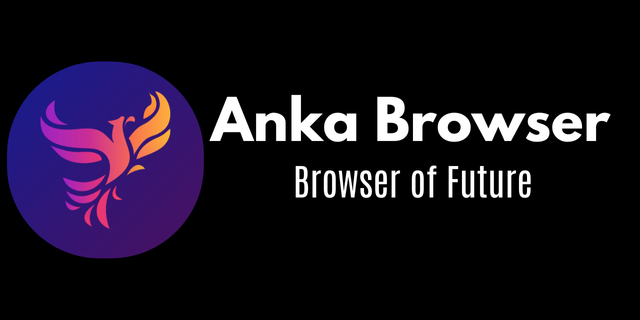

# Anka 
Anka is a browser with developed C++ and Qt. It use QWebEngine technology, so it use Chromium. Made in Türkiye! 🇹🇷🇹🇷

# Anka Browser v2.0
> [!NOTE]
> Before that I had developed a version using PyQt, but the project was canceled due to Python's stupid(!) shortcomings. Now Anka Browser is with you in a more powerful and better version developed with C++. Since it is the second version I made with C++, there are some shortcomings compared to the versions developed with Python. But don't doubt that these will be fixed in the near future.

## What features does this version include? 🔮
- 🟢 Customizable Tabs
 
- 🔍 Changable Search Engine
  
- 🕵️ Show Your Browser History and Downloads History
  
- 🗑️ Delete Your Browser History
  
- 📑 Bookmarks System
  
- 🚀 Better Performance

Hey curious, this README is not very detailed as it was just written. I'll be sure to update it for you personally as soon as I can (hopefully.)!
